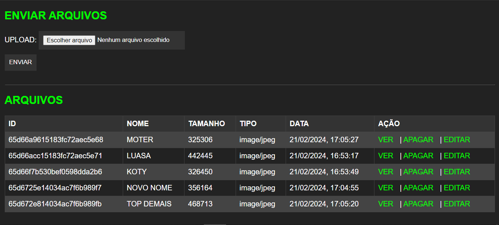
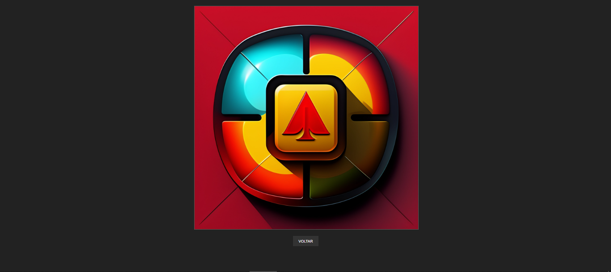
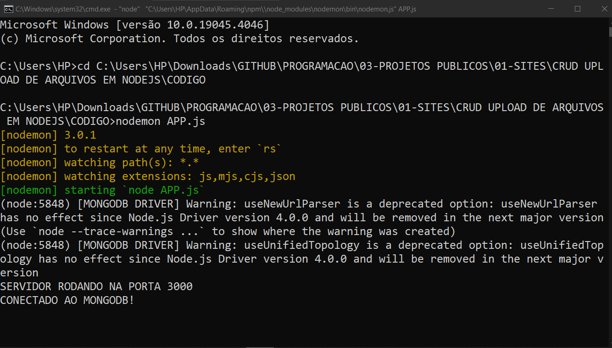
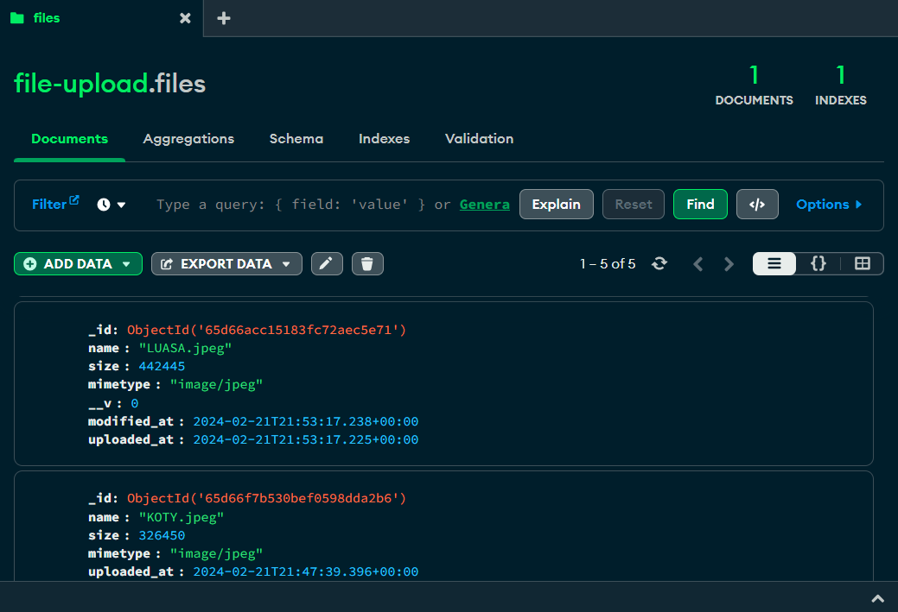
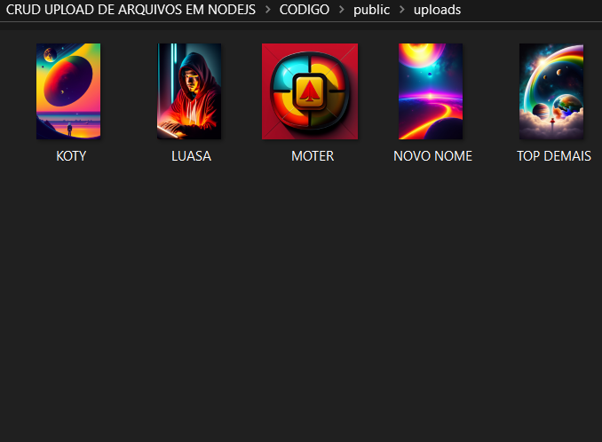

# CRUD UPLOAD DE ARQUIVOS EM NODEJS
👨‍🏫CRUD DE MULTIMIDIAS EM EJS, JS (NODEJS) E MONGODB.

 <br> <br> 
 <br> <br>
 <br> <br>
 <br> <br>
 <br> <br>
 <br> 

## DESCRIÇÃO:
O aplicativo [CRUD](./CRUD.md) de upload de arquivos, sendo um sistema de gerenciamento de arquivos que permite aos usuários fazer upload, visualizar, editar e excluir arquivos de imagem. 

O aplicativo permite aos usuários realizar as seguintes operações:

1. **Upload de Arquivos:** Os usuários podem fazer upload de arquivos de imagem através de um formulário na página inicial. Eles podem selecionar o arquivo desejado em seu dispositivo e enviá-lo para o servidor.

2. **Visualização de Arquivos:** Após o upload, os arquivos de imagem podem ser visualizados na página inicial. Cada arquivo é exibido com seu nome, tamanho, tipo de arquivo e data de upload.

3. **Edição de Arquivos:** Os usuários têm a opção de editar o nome dos arquivos de imagem após o upload. Eles podem acessar a função de edição clicando no botão "Editar" ao lado de cada arquivo na lista.

4. **Exclusão de Arquivos:** Os usuários podem excluir arquivos de imagem que não desejam mais manter. Isso é feito clicando no botão "Apagar" ao lado de cada arquivo na lista.

## COMO USAR?
### BAIXANDO O PROJETO:
* Clone o repositório para o seu sistema local:

```bash
git clone https://github.com/VILHALVA/CRUD-UPLOAD-DE-ARQUIVOS-EM-NODEJS.git
```

* Navegue até o diretório do projeto.

```bash
cd CRUD-UPLOAD-DE-ARQUIVOS-EM-NODEJS
```

* Descompacte o arquivo ZIP (se você baixou manualmente):

```bash
unzip CRUD-UPLOAD-DE-ARQUIVOS-EM-NODEJS.zip
```

### EXECUTANDO O PROJETO:
1. **Conectando o MONGODB:**

   - Antes de você executar esse APP, você precisa conectar o MONGODB. Para deixar o MongoDB ligado e executando, você pode seguir estas instruções:

   1. **Iniciar o Servidor MongoDB:**
      - No prompt de comando (Windows) ou no terminal (macOS/Linux), execute o seguinte comando para iniciar o servidor MongoDB:
      ```
      mongod
      ```
      - Se o MongoDB estiver instalado corretamente e as variáveis de ambiente estiverem configuradas, o servidor será iniciado e estará pronto para aceitar conexões.

   2. **Verificar se o MongoDB está em execução:**
      - Após iniciar o servidor, você pode verificar se o MongoDB está em execução abrindo outro prompt de comando/terminal e executando o seguinte comando:
      ```
      mongo
      ```
      - Isso abrirá o shell do MongoDB, que estará conectado ao servidor local por padrão. Se você ver uma mensagem indicando que está conectado ao servidor, então ele está em execução.

   3. **Manter o Terminal Aberto:**
      - Para manter o MongoDB em execução enquanto você estiver usando sua aplicação Python, é importante manter o terminal aberto onde você iniciou o servidor MongoDB.

2. **Importar o `DATABASE.json`**
   - Como você já baixou esse projeto com uma foto de modelo dentro de `CODIGO/public/uploads/NODEJS.png`, é de suma importância que você import o database.
   Claro! Aqui estão as instruções para importar um arquivo JSON para o MongoDB via shell e via Compass:

   **Via Shell:**

   1. Abra o terminal ou prompt de comando.
   2. Navegue até o diretório onde o arquivo `DATABASE.json` está localizado, usando o comando `cd` (change directory).
   3. Use o utilitário `mongoimport` para importar o arquivo JSON para o MongoDB. O comando é o seguinte:

      ```bash
      mongoimport --db file-upload --collection files --file DATABASE.json
      ```

   4. Dependendo da sua configuração, você pode precisar fornecer credenciais adicionais, como o nome de usuário e senha do MongoDB.

   **Via Compass:**

   1. Abra o MongoDB Compass.
   2. Clique em "Connect" para se conectar a um servidor MongoDB. Insira as informações de conexão necessárias, como o endereço do servidor, a porta e suas credenciais, se aplicável. Em seguida, clique em "Connect".
   3. Após se conectar, clique em "Create Database" para criar um novo banco de dados, se necessário.
   4. Selecione o banco de dados onde deseja importar os dados.
   5. Clique em "Collection" para criar uma nova coleção ou selecionar uma coleção existente onde deseja importar os dados.
   6. Na coleção selecionada, clique em "Import Data".
   7. No menu suspenso, selecione "JSON" como o formato de arquivo.
   8. Clique em "Select File" e navegue até o local do arquivo `DATABASE.json`.
   9. Selecione o arquivo e clique em "Open".
   10. Clique em "Import" para iniciar o processo de importação.

3. **Configuração do `APP.js`:** 
   - Certifique-se de ter um servidor MongoDB em execução localmente na porta padrão (27017), ou ajuste a URL de conexão de acordo com sua configuração.

4. **Instalando as Depêndencias:**

   - Para instalar as dependências listadas no arquivo "package.json", você pode usar o comando `npm install` ou simplesmente `npm i` no terminal. Certifique-se de estar no diretório do seu projeto onde o arquivo "package.json" está localizado. O npm irá ler o arquivo "package.json" e instalar todas as dependências listadas nele. 

   - Aqui está o comando:

   ```bash
   npm install
   ```

   ou

   ```bash
   npm i
   ```

   - Ou se você prefirir, apenas execute esse comando:
   ```bash
   npm install express
   ```

5. **Executando o Aplicativo:**

   - Para subir o servidor, no diretório do seu [projeto](./CODIGO/APP.js), digite o seguinte comando no Terminal/CMD:
   ```bash
   node APP.js
   ```
   - OU:
   ```bash
   nodemon APP.js
   ```

   - Acesse o APP no navegador visitando `http://localhost:3000`.

## NÃO SABE?
- Entendemos que para manipular arquivos em `HTML`, `CSS` e outras linguagens relacionadas, é necessário possuir conhecimento nessas áreas. Para auxiliar nesse aprendizado, oferecemos cursos gratuitos disponíveis:
* [CURSO DE HTML E CSS](https://github.com/VILHALVA/CURSO-DE-HTML-E-CSS)
* [CURSO DE NODEJS](https://github.com/VILHALVA/CURSO-DE-NODEJS)
* [CURSO DE MONGODB](https://github.com/VILHALVA/CURSO-DE-MONGODB)
* [CONFIRA MAIS CURSOS](https://github.com/VILHALVA?tab=repositories&q=+topic:CURSO)

## CREDITOS:
- [PROJETO CRIADO PELO VILHALVA](https://github.com/VILHALVA)


